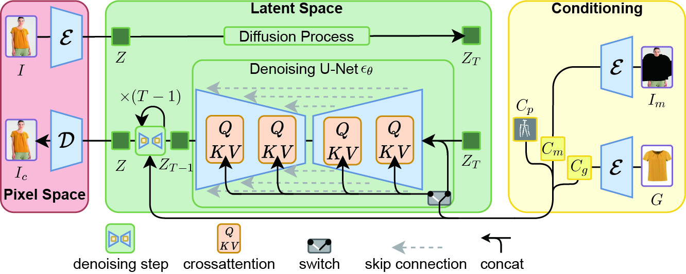

# DiffusionVTON: A Image-Based Virtual Try-On Framework using Denoising Diffusion Models


We propose DiffusionVTON, a virtual try-on framework that employs denoising diffusion models. Our approach utilizes pose keypoints, target models, and clothing images, reducing the need for additional inputs and mitigating the effects of potentially inaccurate intermediate predictions. DiffusionVTON leverages a pre-trained autoencoder and a denoising U-Net, operating in a low-dimensional latent space. Our framework performs well in traditional virtual try-on tasks and can be extended to other tasks, such as multi-pose virtual try-on. In summary, we introduce the first image-based virtual try-on framework that utilizes a diffusion model to produce realistic try-on results.


# Getting Started
## Installation
1. Environment

```bash
conda env create -f environment.yaml
conda activate ldm-vton
```

2. Datasets: [VITON](https://drive.google.com/file/d/1-_vDUX6STbwxxZYQCUew268nycuHzgxs/view?usp=sharing),[MPV](https://drive.google.com/file/d/1-eJffSBhd0nZdMtZ1uo-i9tLtf_Q88Hn/view?usp=sharing) put the datasets into './datasets/VITON_DAF' and './datasets/mpv'.

3. Checkpoints: 
- [vq-f4](https://ommer-lab.com/files/latent-diffusion/vq-f4.zip), put this checkpoint into 'models/first_stage_models/vq-f4/model.ckpt'.

- [VITON](https://drive.google.com/file/d/1-HHeS9Zb-_Mwd1zaF5oCk7kHHeSxH_cE/view?usp=sharing)(optional)

- [MPV](https://drive.google.com/file/d/1-XIKyacOwBgejNsgpeA7vK6dmnYeQxhQ/view?usp=sharing)(optional)


## Train DiffusionVTON

```bash

$ python main.py --base ./configs/latent-diffusion/viton256-vq-f4.yaml  -t --gpus '0,1,2,3,4,5,6,7' --scale_lr False

```

## Evaluation
- Viton paired setting

```bash
$ python test_vton.py --dataset viton_daf_unpair --dataroot datasets/VITON_DAF --outdir ./viton_output --configs configs/latent-diffusion/viton256-vq-f4.yaml --checkpoint *.ckpt --batchsize 32
```
- Viton unpaired setting

```bash
$ python test_vton.py --dataset viton_daf_pair --dataroot datasets/VITON_DAF --outdir ./viton_output --configs configs/latent-diffusion/viton256-vq-f4.yaml --checkpoint *.ckpt --batchsize 32
```
You can use 'test_vton_mask.py' instead of 'test_vton.py' to fix the background for better visual effects and higher FID values

# Acknowledgments
Our code references the implementation of [latent-diffusion](https://github.com/CompVis/latent-diffusion).

# Citation
If you use this code for your research, please cite the following:
```

```